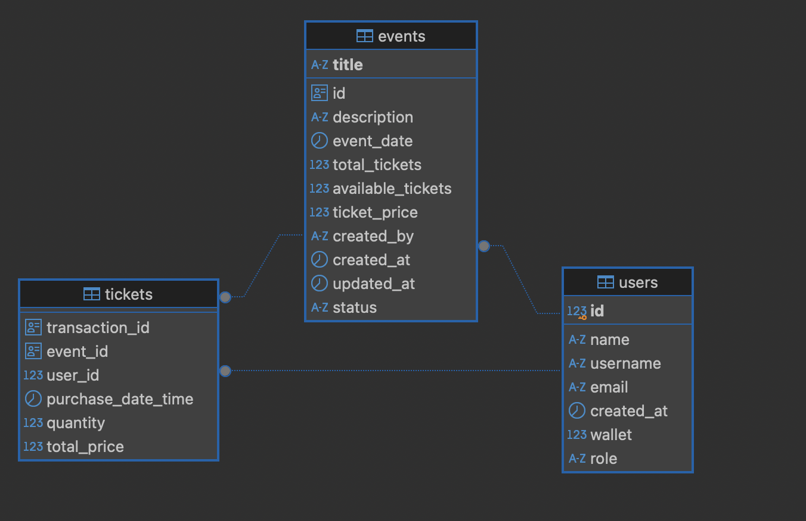

# Event Ticketing System

This is a simple event ticketing system that allows creating events, managing ticket inventory, and ticket purchases.
It is built using Kotlin and Micronaut. The database is PostgreSQL and the ORM is JPA.

Java 21 is required to run this application.

## How to run the application
1. Clone the repository
2. Install Java 21
3. Install Docker and Docker Compose
4. Spin up the docker container to run the PostgreSQL database
```shell
docker-compose -f docker-compose.yml up -d
```
2. Run the following command to start the application
```shell
./gradlew run
```
3. The application will be running on `http://localhost:8080`

## API Documentation
The API definition is available at folder `api-spec` in the root of the project.


## Assumptions made

1. Single location support. The system currently doesn't support multiple locations, and all the events are assumed to be at a single location.
2. No seat allocation, the ticket is for a general admission to the event
3. No payment gateway integration. The user has a wallet balance and the ticket is booked based on the wallet balance.
4. There is no user authentication, actions are restricted based on the role of the user.
5. A new user is created as a regular user. The user can be promoted to an admin by updating the user role in the database.
6. A user can book max 5 tickets at a time.


### Wishlist
1. Add support for multiple locations
2. Add support for seat allocation
3. Add payment gateway integration or ability to add funds to the wallet
4. Add tests (functional and integration) for the application

## Design Decisions

1. I chose Micronaut as it is a lightweight framework that is easy to use and has good support for Kotlin. This is something that I have used in the past, and I am comfortable with.
2. I chose JPA for ORM due to its ease of use and features like query methods and pagination support. JPA has good support for Kotlin as well.
3. I used Pessimistic Locking for the ticket purchase to handle concurrent requests. This is to ensure that the tickets are not oversold.
4. I chose for RDBMS as the database as it is a simple application and RDBMS is a good fit for this use case.


### ERD Diagram



